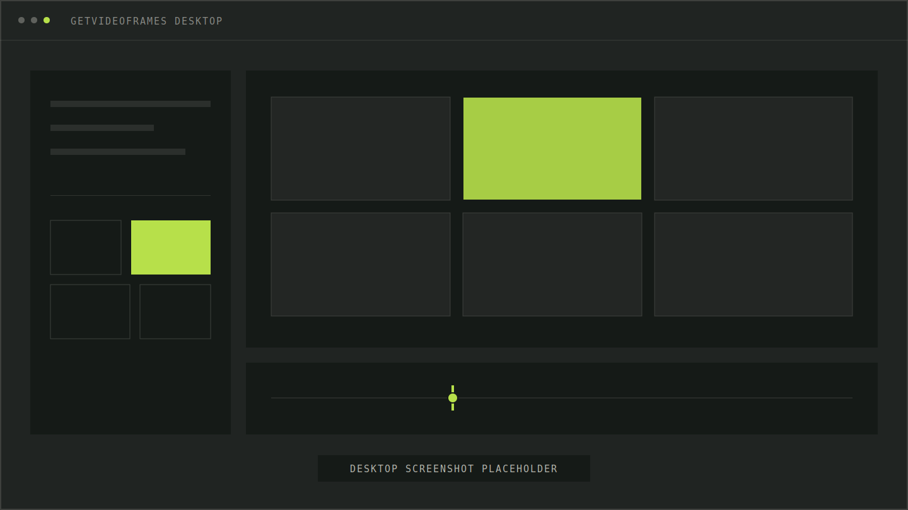

<p align="center">
  <a href="https://getvideoframes.com/" target="_blank">
    <picture>
      <source media="(prefers-color-scheme: dark)" srcset="https://getvideoframes.com/logo-with-text-on-dark.svg">
      
    </picture>
  </a>
</p>

<p align="center">
  <a href="LICENSE"></a>
  <a href="https://github.com/GetVideoFrames/gvf/actions/workflows/ci.yml"></a>
  
  
</p>

<h2 align="center">Open-source video frame intelligence.</h2>

<p align="center">
  A local CLI and MCP server for finding the frames worth keeping.<br>
  Probe, extract, analyze, detect, select, and export — without uploading your video.
</p>

<p align="center">
  <a href="https://getvideoframes.com/"><strong>Try the web app</strong></a>
  ·
  <a href="#getvideoframes-desktop"><strong>Get Desktop</strong></a>
  ·
  <a href="https://github.com/GetVideoFrames/getvideoframes-ios"><strong>iOS app</strong></a>
  ·
  <a href="https://getvideoframes.com/developers/"><strong>API & managed MCP</strong></a>
  ·
  <a href="docs/MCP.md"><strong>Local MCP docs</strong></a>
</p>

<br>

<p align="center">
  
</p>

<!-- Replace docs/assets/desktop-studio-preview.svg with a real Desktop product screenshot when ready. -->

## Find the frames worth keeping

GVF turns a video into an explainable frame-selection workspace. Its recommended `gvf run` pipeline samples low-resolution candidates, analyzes them, optionally detects objects, selects the useful moments, and re-extracts only those timestamps at export quality.

- **Local by design** — Core, CLI, and MCP include no telemetry and do not upload videos.
- **Agent ready** — bounded MCP responses return summaries and artifact paths instead of flooding model context.
- **Explainable selection** — rank by quality, deduplicate, choose per scene, and keep selection reasons.
- **Accurate output** — selected timestamps are re-extracted from the source at final quality.
- **Automation friendly** — versioned JSON on stdout; JSONL progress and logs on stderr.
- **MIT licensed** — GVF-owned Core, CLI, local MCP, FFmpeg integration, and vision interfaces are open source.

## Choose how you work

| Product                                                   | Status                          | Best for                                                |
| --------------------------------------------------------- | ------------------------------- | ------------------------------------------------------- |
| **GVF CLI**                                               | Open source · available         | Scripts, pipelines, batch jobs, and direct control      |
| **GVF local MCP**                                         | Open source · available         | Local agents that need video frame tools over stdio     |
| **[GetVideoFrames Web](https://getvideoframes.com/)**     | Available                       | Fast visual extraction in a compatible browser          |
| **GetVideoFrames Desktop**                                | Available for Apple Silicon Mac | A dedicated visual workflow on your computer            |
| **[GetVideoFrames iOS](https://github.com/GetVideoFrames/getvideoframes-ios)** | Available                       | On-device smart frame extraction on iPhone and iPad     |
| **[Managed API](https://getvideoframes.com/developers/)** | Planned                         | Hosted frame jobs for applications and teams            |
| **[Managed MCP](https://getvideoframes.com/developers/)** | Planned                         | Remote agent access without operating the local runtime |

The hosted API and managed MCP do **not** exist yet. The [developer preview](https://getvideoframes.com/developers/) describes the direction without promising endpoints, pricing, or a launch date.

## Quick start

### Requirements

- **Node.js 22 or newer**
- **FFmpeg** and **ffprobe** on `PATH`, or set `GVF_FFMPEG_PATH` and `GVF_FFPROBE_PATH`
- Optional object detection: `onnxruntime-node` and the verified YOLOX-Nano weights installed by `gvf setup vision`

### Install from source

```bash
git clone https://github.com/GetVideoFrames/gvf.git
cd gvf
npm install
npm run build
npm link -w @gvf/cli -w @gvf/mcp
```

Check the local runtime:

```bash
gvf doctor --pretty
```

Select sharp frames containing people and export high-quality JPEGs:

```bash
gvf run video.mp4 \
  --with person \
  --rank sharpness \
  --dedupe \
  --best-per-scene 1 \
  --export ./frames \
  --pretty
```

Or start with a preset:

```bash
gvf run video.mp4 --preset storyboard --export ./storyboard
gvf run video.mp4 --preset people --export ./people
```

> `gvf run` is the recommended entry point. Use the primitive commands when you need to control each stage yourself.

## CLI

| Command                    | Purpose                                                           |
| -------------------------- | ----------------------------------------------------------------- |
| `gvf run`                  | **Recommended:** analyze and detect → select → optional HQ export |
| `gvf doctor`               | Inspect FFmpeg, ffprobe, ONNX Runtime, and model readiness        |
| `gvf setup ffmpeg\|vision` | Show a guided, provenance-aware runtime setup                     |
| `gvf probe`                | Read rotation-safe video metadata                                 |
| `gvf extract`              | Deterministic direct extraction or candidate workspace creation   |
| `gvf analyze`              | Measure scenes, sharpness, exposure, and duplicates               |
| `gvf detect`               | Detect COCO objects with optional YOLOX-Nano                      |
| `gvf select`               | Write explainable selections without exporting                    |
| `gvf export`               | Re-extract selected timestamps at final quality                   |

Every data command writes **versioned JSON to stdout** and progress/log records as **JSONL to stderr**. Add `--pretty` for readable JSON.

Sampling accepts exactly one of `--every`, `--fps`, `--count`, repeated `--at`, or `--all`, plus optional `--from` and `--to` boundaries. Candidate sampling defaults to a 0.5-second interval with a 1,200-frame budget.

Output directories must be fresh or empty. `--overwrite` replaces only GVF-owned or exact export targets and preserves unrelated files.

## Local MCP server

After linking the workspace binaries, add GVF to an MCP client:

```json
{
  "mcpServers": {
    "gvf": {
      "command": "gvf-mcp"
    }
  }
}
```

Use **`gvf_run`** for the complete workflow. Advanced tools mirror the CLI primitives:

`gvf_probe` · `gvf_extract` · `gvf_analyze` · `gvf_detect` · `gvf_select` · `gvf_export` · `gvf_runtime_status`

The MCP server is local stdio, calls Core directly, never installs dependencies, and returns bounded structured results. See the [MCP guide](docs/MCP.md) for Inspector and evaluation workflows.

## How GVF works

```text
source video
    ↓
bounded low-resolution candidates
    ↓
scene / quality / duplicate analysis
    ↓
optional object detection
    ↓
explainable selections
    ↓
HQ re-extraction from source timestamps
```

The workspace uses the unstable `gvf.manifest/v1alpha1` contract:

```text
workspace/
├── manifest.json       source, sampling, providers, and artifacts
├── frames.jsonl        one frame record per line
├── selections.json     selected frames and reasons
└── frames/             candidate assets
```

Repository packages:

```text
packages/core      shared handlers, workspace, analysis, and selection
packages/cli       gvf command-line interface
packages/mcp       gvf-mcp stdio server; calls Core, never shells to CLI
packages/ffmpeg    runtime resolution, process execution, and setup contracts
packages/vision    YOLOX provider, COCO taxonomy, and vision interfaces
```

## GetVideoFrames Desktop

The open-source project is intentionally CLI- and agent-first. **GetVideoFrames Desktop** adds a dedicated visual interface for people who prefer timelines, previews, and direct selection over terminal workflows.

The current download supports **Apple Silicon Mac**. Visit [getvideoframes.com](https://getvideoframes.com/) to download it and follow future platform releases.

The Desktop app is a separate commercial product and is not included in this MIT repository.

## Privacy and product boundaries

|              | GVF open source           | Web & Desktop                     | Future managed API & MCP               |
| ------------ | ------------------------- | --------------------------------- | -------------------------------------- |
| Runtime      | Your machine              | Browser or desktop app            | GetVideoFrames-operated infrastructure |
| License      | MIT for GVF-owned source  | Proprietary product               | To be defined before launch            |
| Telemetry    | None in Core, CLI, or MCP | Governed by product privacy terms | To be defined before launch            |
| Availability | CLI + local stdio MCP     | Web + Apple Silicon Desktop       | Not available yet                      |

Third-party binaries, models, and assets keep their own licenses. See [Third-Party Notices](THIRD_PARTY_NOTICES.md), [Ownership](docs/OWNERSHIP.md), and [Provenance](docs/PROVENANCE.md).

## Project status

GVF is currently **`0.1.0`** and its public workspace/API contract is **`v1alpha1` (unstable)**.

Known release boundaries:

- Text-analysis interfaces exist, but text model downloads remain blocked until provenance is verified.
- Managed FFmpeg sidecar downloads remain blocked; install system FFmpeg today.
- npm publishing and contract freeze remain validation work, so installation is from source.

Read [V1 readiness](docs/V1_READINESS.md) before building a long-lived integration against the current contract.

## Development

```bash
npm install
npm run format:check
npm run lint
npm run typecheck
npm test
npm run build
npm run audit
npm run sbom
npm run license:check
npm run pack:check
```

The repository intentionally pins TypeScript 5.9 while the current ESLint toolchain is validated.

## Community

- Found a bug or have a focused feature request? [Open an issue](https://github.com/GetVideoFrames/gvf/issues).
- Want to contribute code? Start with an issue, keep changes scoped, and include tests for behavior changes.
- Building something with GVF? Open an issue and tell us about the workflow you want the project to support.
- If GVF is useful, **star the repository and share it** so more developers can find local video frame tools.

## License

[MIT](LICENSE) for GVF-owned source. Third-party components retain their respective licenses and notices.
